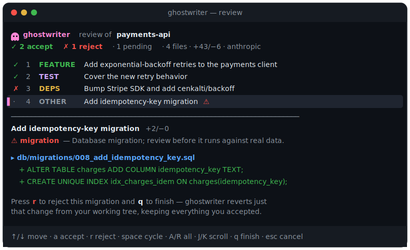

<div align="center">

# 👻 ghostwriter

### See exactly what your AI agent changed — as a story — *before* you accept it.

`ghostwriter` reads the changes sitting in your working tree (whatever Claude
Code, Cursor, Codex, or Aider just did), narrates them **grouped by intent** in
plain English, flags the risky bits, and lets you **accept or reject each intent
with one keystroke** — applying your rejections back to your files.

Reviewing agent diffs is the most dreaded part of agentic coding. ghostwriter
turns the wall of diff into a short, skimmable review.

[](https://github.com/agenticraptor/ghostwriter/actions/workflows/ci.yml)
[](https://github.com/agenticraptor/ghostwriter/releases)
[](https://pkg.go.dev/github.com/agenticraptor/ghostwriter)
[](https://goreportcard.com/report/github.com/agenticraptor/ghostwriter)
[](LICENSE)

<br>



</div>

---

> **Try it in one line — no signup, no API key required:**
>
> ```bash
> go run github.com/agenticraptor/ghostwriter/cmd/ghostwriter@latest --print
> ```
>
> Run it in a repo your agent just edited. With no key it groups changes with
> fast, offline heuristics. Add an API key (or point it at a local Ollama) and
> the same command narrates each intent in plain English.

In the screen above, pressing **`r`** on intent 4 and **`q`** to finish reverts
*just* that migration from your working tree — keeping the retry logic, tests,
and dependency bump you accepted. Nothing else is touched, and the reverted
change is backed up so you can restore it any time.

<!--
  📸 Even better than the static image: a 15–20s screen-capture GIF of a real
  review (navigating intents, rejecting one, watching it revert). The hero GIF
  is the single biggest driver of stars — record one, drop it at docs/demo.gif,
  and swap the  above for it.
-->

Prefer plain output? `ghostwriter --print` narrates without the UI and never
touches your files — perfect for CI, piping, or a quick skim:

```text
👻 ghostwriter  review of payments-api
4 intents · 4 files · +43/−6 · anthropic claude-sonnet-4-6

 1  FEATURE   Add exponential-backoff retries to the payments client
    Wraps the charge call in a 3-try backoff loop and updates its 3 call sites.
    internal/pay/client.go  +24/−6

 2  TEST      Cover the new retry behavior
    Adds a table-driven test asserting three attempts before giving up.
    internal/pay/client_test.go  +12/−0

 3  DEPS      Bump Stripe SDK and add cenkalti/backoff
    go.mod  +5/−1
    ℹ deps

 4  OTHER     Add idempotency-key migration
    db/migrations/008_add_idempotency_key.sql  +2/−0
    ⚠ migration

dependency changes:
  ＋ github.com/cenkalti/backoff/v4 v4.3.0 (go)
  ＋ github.com/stripe/stripe-go/v76 v76.25.0 (go)
```

## Why

In 2026 the bottleneck of AI-assisted coding isn't writing code — it's
**reviewing** it. Agents produce sprawling, multi-file diffs that are "almost
right but not quite," and reading them hunk-by-hunk is exhausting and
error-prone. Raw diff viewers (`delta`, `difftastic`) make the diff *prettier*;
they don't tell you **what the agent was trying to do** or let you act on it.

ghostwriter is the missing review layer:

- **A story, not a diff.** Related hunks across files are grouped into a handful
  of plain-English *intents* — "added retry logic," "updated 3 call sites,"
  "bumped the Stripe SDK."
- **Risk-aware.** Migrations, lockfile and dependency edits, CI/Docker changes,
  possible secrets, and large or test-removing deletions are flagged
  automatically — even with no model.
- **Act per intent.** Accept the good parts, reject the rest with one key, and
  ghostwriter applies your rejections back to the working tree for you.
- **Agent-agnostic & local.** It reads your git working tree, so it works with
  any tool that edits files. Your code never leaves your machine unless you
  choose a cloud model.

## Features

- 🪄 **Intent-grouped review** of everything your agent changed, rendered
  beautifully in your terminal (or as Markdown / JSON / plain text).
- ⌨️ **One-key accept/reject** in an interactive TUI — rejections are reverted
  from your working tree via a safe, checked `git apply`, and **backed up first**
  so you can always restore them.
- ⚠️ **Automatic risk flags**: migrations, lockfiles, dependency manifests,
  CI/Docker, infra-as-code, possible secrets, and risky deletions.
- 📦 **Dependency change detection** across npm, Go, pip, and Cargo.
- 🧠 **Bring your own model:** Anthropic, OpenAI, or a fully-local **Ollama** —
  auto-selected from your environment.
- 🪫 **Works with zero config:** no API key? You still get a deterministic,
  offline review with the heuristic risk flags intact.
- 🆕 **Sees new files too** — untracked files your agent created are part of the
  review (reject = delete).
- 📦 **Single static binary.** No runtime, a handful of direct dependencies.

## Install

### `go install`

```bash
go install github.com/agenticraptor/ghostwriter/cmd/ghostwriter@latest
```

### Pre-built binaries

Grab a binary for your OS/arch from the
[**Releases**](https://github.com/agenticraptor/ghostwriter/releases) page.

### Homebrew (macOS / Linux)

```bash
brew install agenticraptor/tap/ghostwriter
```

> Available once the Homebrew tap is published — see the note in
> [`.goreleaser.yaml`](.goreleaser.yaml) to enable it.

### From source

```bash
git clone https://github.com/agenticraptor/ghostwriter
cd ghostwriter
make install
```

## Quickstart

```bash
# 1. Your agent just made a mess of edits. Review them interactively:
cd ~/code/my-project
ghostwriter

#    ↑/↓ to move, a/r to accept/reject each intent, q to finish.
#    Rejected intents are reverted from your working tree.

# 2. Just want the narrated summary (no UI, never modifies files)?
ghostwriter --print

# 3. Turn on AI narration (pick one):
export ANTHROPIC_API_KEY=sk-ant-...      # or OPENAI_API_KEY=sk-...
ghostwriter

# 4. Prefer 100% local? Run Ollama and use it instead:
ghostwriter --provider ollama --model llama3.1

# 5. Offline, instant, free — heuristic grouping with risk flags:
ghostwriter --no-ai --print
```

## Usage

```text
ghostwriter [flags]            Review pending changes (interactive in a terminal)
ghostwriter review [flags]     Same as above, explicitly
ghostwriter config <init|path|show>
ghostwriter doctor             Check your environment and configuration
ghostwriter version
```

Common flags:

| Flag | Description |
|------|-------------|
| `-r, --repo <path>` | Repository to review (default `.`) |
| `--against <ref>` | Compare the working tree against this ref (default `HEAD`) |
| `--staged` | Review only staged changes (index vs `HEAD`) |
| `--no-untracked` | Skip new, untracked files |
| `--print` | Print the narrated review; **never** modifies files |
| `-f, --format` | `term` · `plain` · `markdown` · `json` |
| `-o, --output <file>` | Write the review to a file |
| `--provider`, `--model` | Override the LLM provider/model |
| `--no-ai` | Skip the model; use deterministic offline grouping |
| `-y, --yes` | Apply rejections without the confirmation prompt |
| `--no-color` | Disable colored output |

Examples:

```bash
ghostwriter --print -f markdown -o review.md   # a shareable Markdown review
ghostwriter --no-ai                            # offline, instant, free
ghostwriter --staged                           # only what you've git-added
ghostwriter --print -f json | jq '.intents[].risks'   # machine-readable
```

## How it works

```
                 ┌─ git diff HEAD ─────────────┐
working tree ────┤                             ├─► parse into files + hunks ─┐
                 └─ untracked new files ───────┘                             │
                                                                            ▼
                                              group into intents  ◄── LLM narrator
                                              (deterministic if no model)   │
                                                                            ▼
                                          annotate with risk flags + dep changes
                                                                            │
                  ┌──────────────────────────────┬──────────────────────────┘
                  ▼                               ▼
        interactive TUI                    render (term / md / json)
   accept / reject per intent                 (read-only)
                  │
                  ▼
   git apply --reverse (checked)  ──►  rejected intents reverted; rest kept
```

Every line count and risk flag is recomputed from the real diff, so the numbers
are trustworthy even when the narrative comes from a model. Rejections are
applied with a **checked** `git apply --reverse` (a dry run must pass first), so
a change that can't be cleanly reverted is reported rather than half-applied —
ghostwriter never corrupts your tree.

See [docs/how-it-works.md](docs/how-it-works.md) for the full pipeline.

## Configuration

Configuration is optional. The file lives at
`~/.config/ghostwriter/config.toml` (run `ghostwriter config path` to see the
exact location). Create a documented starter with:

```bash
ghostwriter config init
```

```toml
[ai]
provider = ""            # anthropic | openai | ollama (empty = auto-detect)
model = ""               # empty = provider default
enabled = true           # false = always use offline heuristics
max_diff_bytes = 14000   # caps tokens sent to the model

[review]
against = "HEAD"
include_untracked = true
```

API keys are **never** stored in the file — they're read from the environment
(`ANTHROPIC_API_KEY`, `OPENAI_API_KEY`). See
[docs/configuration.md](docs/configuration.md) and
[docs/providers.md](docs/providers.md) for the full reference.

## Privacy

ghostwriter runs entirely on your machine. The **only** time anything leaves
your computer is when you opt into a cloud model (Anthropic/OpenAI), in which
case a *size-capped* sample of the diff is sent to that provider to write the
narrative — and lines that look like secrets are **redacted before they are
sent**. Want zero egress? Use `--no-ai` or `--provider ollama` and nothing ever
leaves your laptop.

A few safety guarantees worth knowing: untracked **symlinks are never followed**
(so a repo can't trick ghostwriter into reading files outside it), `--against`
refs are validated so they can't be smuggled to git as options, and **every
rejection is backed up** to `<git-dir>/ghostwriter/rejected-*.patch` before it is
applied — restore any time with `git apply`. See [SECURITY.md](SECURITY.md).

## Contributing

Contributions are very welcome — see [CONTRIBUTING.md](CONTRIBUTING.md). Good
first issues include Cursor/Aider session awareness, more dependency ecosystems
(Maven, Composer, RubyGems), richer risk heuristics, and a `--html` shareable
report. Please also read our [Code of Conduct](CODE_OF_CONDUCT.md).

## License

[MIT](LICENSE) © ghostwriter contributors.
